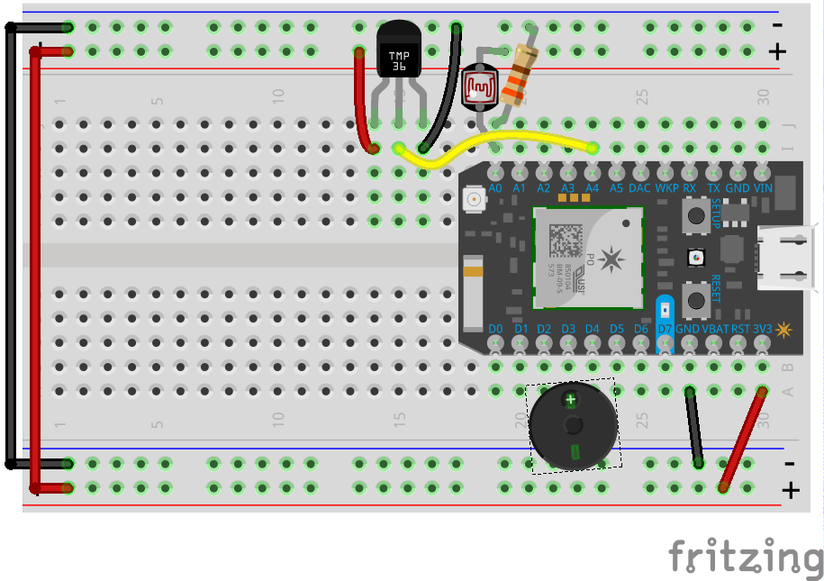

# Losant Fridge Watcher

This Particle firmware accompanies the blog post found at [https://www.losant.com/blog/keep-an-eye-on-your-fridge-with-a-photon-photocell-tmp36-and-buzzer](https://www.losant.com/blog/keep-an-eye-on-your-fridge-with-a-photon-photocell-tmp36-and-buzzer).

## Supported Hardware
  * Particle Photon (**Tested**)
  * Particle Electron
  * Particle Core
  * Redbear Duo

## Part List
  * Particle Photon
  * TMP36 Sensor
  * Photocell
  * Piezo Buzzer
  * 330 Ohm Resistor
  * Jumper Wires
  * Breadboard

## Hardware Assembly


## How to Use the Code
The easiest way to use the code is to clone this repository and then flash it to your Particle device using the CLI tools.

```sh
git clone https://github.com/sidwarkd/losant_fridge_watcher.git
cd losant_fridge_watcher
particle flash [YOUR DEVICE] ./
```
